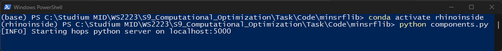
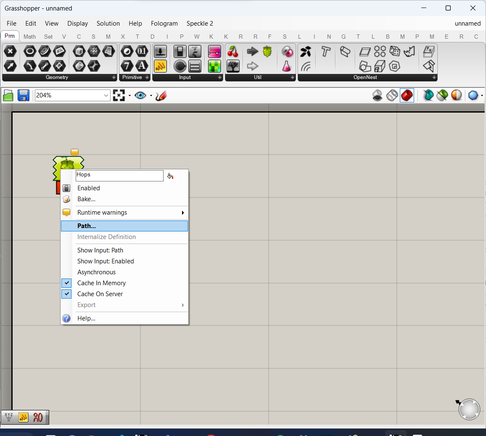
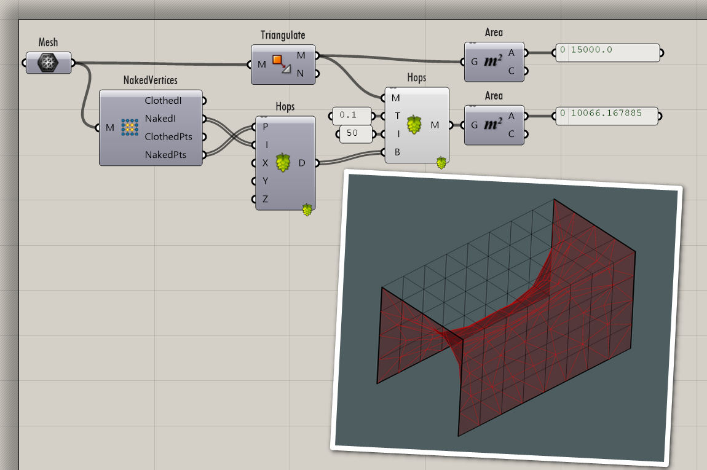
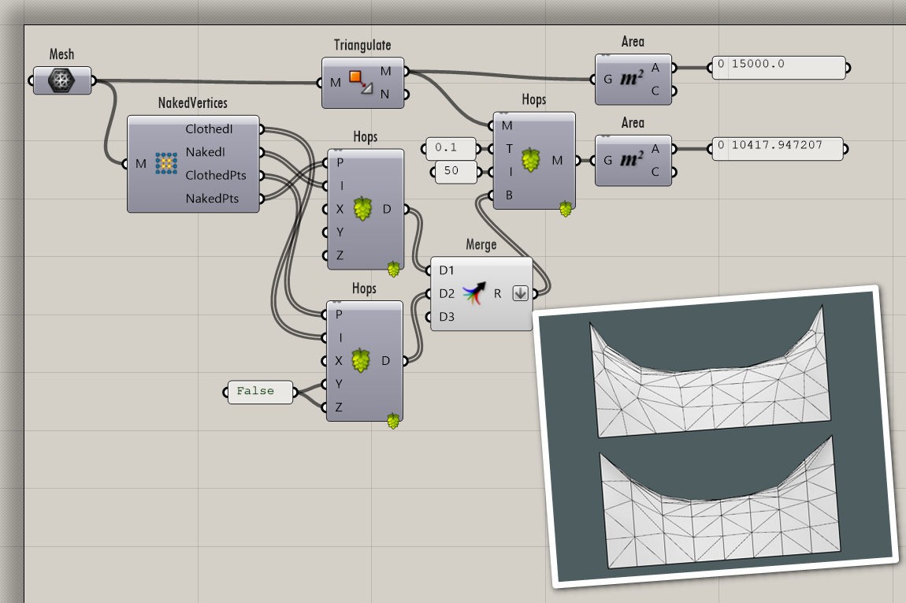
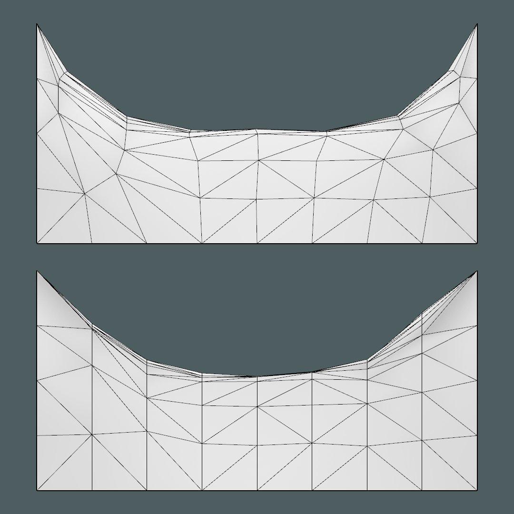

# MinSrfLib

A library to minimize to *surface area* of a given triangular mesh.

## Installation

This application relies on a few pre-existing libraries that must be present on your current python environment. Please refer to their documentation on how to properly install them:

- [ghhops-server-py](https://github.com/mcneel/compute.rhino3d/tree/master/src/ghhops-server-py)
- [Flask](https://flask.palletsprojects.com/en/2.2.x/installation/)
- [Numpy](https://numpy.org/install/)
- [rhinoinside](https://pypi.org/project/rhinoinside/)

Additionally the following applications are used to leverage the functionalities of `MinSrfLib`:

- Rhinoceros *Version 7 SR21(7.21.22208.13001, 2022-07-27)*
- Hops *Version 0.15.1*
- Grasshopper *Build 1.0.0007*

## Usage

To start generating minimal surfaces, follow these steps:

1. Start Rhino and Grasshopper
2. Start the *hops component server* defined in `components.py`
3. Place a *Hops* component on the grasshopper canvas and point it towards the `/minimize` endpoint
4. Load a mesh from rhino, or create one dynamically in grasshopper
5. *(Optionally)* define some *boundary conditions* for simulation to adhere to
6. Connect all inputs to the *Hops* component to start the simulation

### Starting the hops component server

To start the *hops component server* navigate to the `MinSrfLib` folder, activate your python environment and run the `components.py` script.

```sh
conda activate your-python-environment-for-minsrflib
python components.py
```



### Connecting a hops component to the component server

To connect a hops component to the *hops component server*, you need to point it's *path* property to the corresponding endpoint defined on the server. In the case of the `minimize` function, this endpoint is defined at `http://localhost:5000/minimize`. Other functions will have other endpoint names.




## Simulation component

To run a simulation, the hops component for the `/minimize` endpoint expects 4 inputs:

- Mesh, the mesh to minimize. This **must** be triangulated and have only **unique** vertices
- Tolerance, the tolerance to use for area comparison. Since the minimzation is iteratively, the area after ever step is compared to the area before that step. If the difference is less than the tolerance value, the calculation is stopped immediately.
- Iterations, the maximum number of iterations
- Boundary conditions, the boundary conditions that should act on individual vertices of the mesh. Typically you would at least define a few *vertex anchors* to not have the simulation collapse on itself.



## Boundary Condition components

In `MinSrfLib`, there are several options to define certain *boundaries* the simulation **must** adhere to:

- Vertex anchors, those anchors will never move during the simulation
- *Partial* vertex anchors, those anchors constrain their vertices in any combination of global $x$, $y$ and $z$ direction
- On circle, will constrain the given vertices to a circle boundary
- On line, will constrain the given vertices to a line **(WIP)**

### Vertex Anchors

wip

### Partial Vertex Anchors

Here users have the opportunity to constrain vertices to any combination of the global coordinate axes. This can be useful to keep vertices on a conceptual grid f.e.



As shown in the above, the first simulation has the inner vertices free, which will typically yield better simulation results, while the second (lower) simulation constrained the inner vertices in one direction, keeping the initial grid the vertices layed on intact in the front view.



### On circle

wip

### On Line

wip

