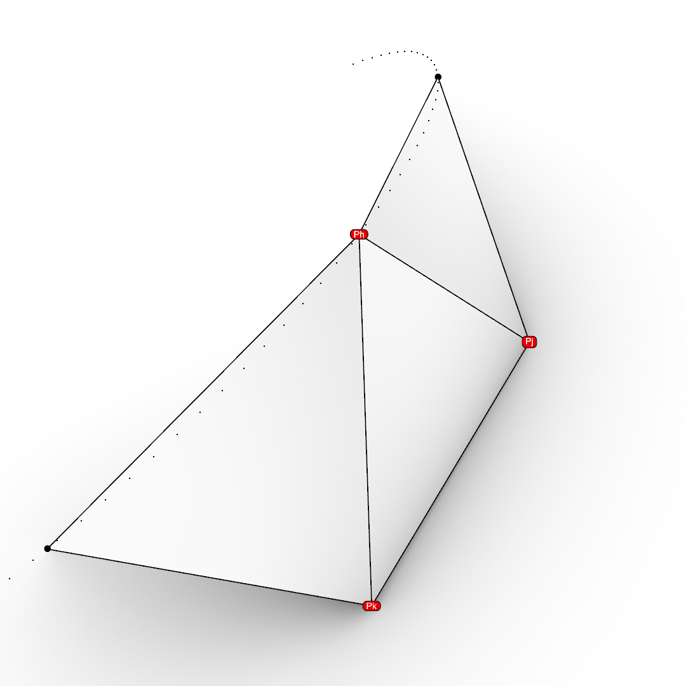

# Introduction

> The story of soap bubbles in mathematics, science, architecture and art is a never-ending story.
> &mdash; *Michele Emmer*

In the module *S9 - Computational optimization* we take a deeper look at the theory behind minimal surfaces and will develop a simple *polygon mesh based* solver integrated into the *Rhinoceros* and *Grasshopper* software package. This solver will be able to process arbitrary three dimensional polygon meshed, as long as they are triangular and have only **unique** vertices. The solver also gives users the opportunity to define certain *boundary conditions* for any given vertex of the input mesh. Those conditions will modify how the optimization is run and thus yield different results.


## Minimal surfaces

A surface is considered *minimal*, if it's *mean curvature* $c$ is 0 at any given point on the surface. This property also ensures that if we compare a minimal surface to another one spanning the same space, the area $A_{min}$ of the minimal surface will be smaller as the area of the other surface. If we consider a surface to be parametrized over it's $u$ and $v$ domain $D$, this gives:

$$c_{u,v} = 0 , \forall u,v \in D$$

## Minimal polygon meshes

For the solver, we simplify the representation of a surface to that of a *triangulated* polygon mesh $M$, where all it's vertices lie on the target, minimal surface. The area of a triangle mesh can be simply calculated by calculating the sum of areas of all it's triangular faces, regardless of it's shape. Let $M$ be a polygon mesh, which has the following elementary parts:

- $I = {1,2,...,N}$ is the set of vertex indices of $M$, where $N$ is the number of total *unique* vertices
- $P:I \rightarrow R^3$ is a mapping from a given vertex index to it's location in 3d space
- $T$ is the set of all triangle faces of $M$ and each triangle $t \in T$ is defined as a triplet of vertex indices $t = <i,j,k>$, which maps to the vertices in 3d space $P_i , P_j$ and $P_k$

To calculate the area $A$ of a given triangle mesh $M$, we calculate the sum of areas of all $t \in T$:

$$A = \sum\limits_{t=<i,j,k>\in T} \frac{1}{2}  |P_j P_k \times P_j P_i |$$

# Solver architecture

Our main goal with the software developed for this module, was to give an intuitive and accessible interface to running the solver. Users should be able to iterate on solver runs quickly and visually. To achieve this we integrate the library into the *rhinocers* and *grasshopper* software package. With the use of the *Hops* plugin, we can run any *CPython* code on a server and call into endpoints on that server from grasshopper.


The solver itself is hosted at [GitHub](https://github.com/DerLando/S9-MinSrfLib), together with instructions on how to properly install it, as well as some example files.

## Modules

The solver is written in python and the code is distributed into multiple files, which handle different functionalities of the solver:

- `algorithms.py` contains the actual solver implementation
- `boundary_conditions.py` contains all boundary conditions that users can define
- `geometry.py` defines geometry types used inside of the solver
- `conversion.py` defines conversion routines from *opennurbs* types to our custom geometry types used in the solver
- `components.py` defines all *'components'* as endpoints reachable from Hops

### algorithms.py

In this file we define all private functions needed to run the solver, as well as the main public function to call, `minimize_mesh`

``` python
def minimize_mesh(
    vertices: MeshVertexCollection,
    faces: MeshFaceCollection,
    connectivity: MeshVertexConnectivity,
    tolerance: float,
    max_iterations: typing.Union[float, None],
    boundary_conditions: VertexBoundaryConditionsCollection
    ) -> MeshVertexCollection:
    """
    Minimize the vertex positions of the given mesh,
    so that the total area of the mesh is minimal.
    """

    # code omitted

```

### boundary_conditions.py

We define boundary conditions in *object oriented programming* fashion as objects which inherit from a common base class, `VertexBoundaryCondition`. These objects have some shared functionality:

- Store a reference to the bound vertex coordinates
- Store a reference to the bound vertex index inside of the mesh vertex buffer
- Define how to serialize to *json* and deserialize back to a class instance from a *json* string.

We need to implement json serialization because the different boundary conditions are defined as different *component* endpoints and *hops* does not support sending custom objects. The workaround is the aforementioned serialization to json strings, which can in turn be deserialized inside of the *component* endpoint.

The Boundary conditions defined for users to use are:

- `VertexAnchorCondition`
- `OnCircleBoundaryCondition`

### components.py

In here we define the endpoints for hops components to call into. This is done by annotating a regular python function with the `@hops.component` attribute defined in the *gh-hops-server* python library. Additionaly we need to run a *flask* server that runs *rhinoinside* and serves the endpoints we defined.

As a reference, the endoint for the minimization solving is defined as follows:

``` python

@hops.component(
    "/minimize",
    name="Minimize",
    nickname="MNMZ",
    description="Minimize mesh area",
    category="Mesh",
    subcategory="CPython",
    inputs=[
        hs.HopsMesh("Mesh", "M", "The mesh to minimize"),
        hs.HopsNumber("Tolerance", "T", "The tolerance for minimization"),
        hs.HopsInteger("Max Iterations", "I", "Optional upper limit on iteration count", optional=True, default=-1),
        hs.HopsString("Boundary conditions", "B", "List of vertex boundary conditions to enforce", access=hs.HopsParamAccess.LIST, optional=True, default=None),
    ],
    outputs=[
        hs.HopsMesh("Mesh", "M", "The minimized mesh"),
        hs.HopsNumber("Areas", "A", "The areas at every iteration step", hs.HopsParamAccess.LIST)],
)
def minimize(mesh, tol, iterations, boundary_conditions):

    start = time.time()

    if iterations == -1:
        iterations = None
    
    # Convert from opennurbs mesh to internal types
    vertices, faces, connectivity, boundary_indices = conversion.convert_from_mesh(mesh)

    # if there are no boundary conditions defined, explicitly convert the boundary indices
    # to anchor points
    if boundary_conditions is None:
        boundary_conditions = dict([(i, VertexAnchorCondition(vertices[i], i)) for i in boundary_indices])
    else:
        # Deserialize boundary conditions from json
        conditions = []
        for condition in boundary_conditions:
            if "center" in condition:
                condition = OnCircleBoundaryCondition.from_json(condition)
            else:
                condition = VertexAnchorCondition.from_json(condition)

            conditions.append(condition)

        # boundary_conditions is a flat list, we need to convert it to a dict
        boundary_conditions = build_boundary_collection(conditions)        
    
    # Call into the minimize function
    optimized, areas = algorithms.minimize_mesh(vertices, faces, connectivity, tol, iterations, boundary_conditions)

    # Convert output back to a opennurbs mesh instance
    converted = conversion.convert_to_mesh(optimized, faces)

    # Time runtime and give print feedback
    end = time.time()
    print(f"Minimization took {end - start}ms")

    # Return back result
    return (converted, areas)
```


# Minimization algorithm

## Area minimization

Let $NT(i)\in T$ be the set of all triangles that contain the vertex $P_i$ and let

$$\frac{\partial A}{\partial P_h} = (\frac{\partial A}{\partial (P_h)_x}, \frac{\partial A}{\partial (P_h)_y}, \frac{\partial A}{\partial (P_h)_z})^T$$

We can generalize this over all vertices in the mesh, as defined by their face-triplets $t$

$$\frac{1}{2}\sum\limits_{t=<i,j,k>\in T}\frac{\partial A}{\partial P_h}\sqrt{(P_j P_k \times P_j P_i)^2}$$

$$ = \frac{1}{2}\sum\limits_{t=<h,j,k>\in NT(h)}\frac{1}{2}\frac{\frac{\partial A}{\partial P_h}(P_j P_k \times P_j P_h)^2}{\sqrt{(P_j P_k \times P_j P_i)^2}}$$

$$ = \frac{1}{2}\sum\limits_{t=<h,j,k>\in NT(h)}\frac{(P_j P_k)^2 P_j P_h - (P_j P_k * P_j P_h)P_j P_k}{(P_j P_k \times P_j P_i)^2} $$

We introduce a value $C$ to simplify the calculation with

$$C = \sum\limits_{t=<h,j,k>\in NT(h)} \frac{(P_j P_k)^2\begin{bmatrix}
1 & 0 & 0 \\
0 & 1 & 0 \\
0 & 0 & 1 \end{bmatrix} - (P_j P_k)(P_j P_k)^T}{\sqrt{P_j P_k \times P_j P_h}^2} $$

And by setting $\frac{\partial A}{\partial P_h} = 0$ we can now solve for $P_h$

$$P_h' = -C^{-1} \sum\limits_{t=<h,j,k>\in NT(h)} \frac{(P_j P_k \cdot P_j)P_j P_k - (P_j P_k)^2 P_j}{\sqrt{P_j P_k \times P_j P_h}^2}$$

As we can see, this is not an *explicit* solution for $P_h'$, but we can iteratively calculate new values of lower overall area $A$ for all $P_h'$.

## Boundary conditions

We allow multiple boundary conditions to be defined for a minimization simulation. 

- `Vertex anchor` allows to limit a vertex in any combination of it's degrees of freedom in the world $x$, $y$ and $z$ directions.
- `On circle` allows to limit a vertex to move along the perimeter of a given circle

### Vertex anchor

By limiting vertices in their degrees of freedom, interesting behaviors can emerge. For the simulation to be stable, it is necessary that at least one closed loop of vertices is defined for the mesh on which all the vertices are fully constrained. Since this case is quite common, we have a separate helper function just for checking it

``` python
# Defined in VertexAnchorCondition
def is_fully_constrained(self) -> bool:
    """
    Check to see if the anchor point is fully constrained,
    meaning it can not move at all.
    """
    return self.x_locked and self.y_locked and self.z_locked
```

When we encounter a fully constrained vertex in the simulation, it is simply skipped, meaning we don't need to do any math on it

```python
# This happens inside of the main solve loop of the minimize function
if any([condition.is_fully_constrained() for condition in boundary_conditions[i]]):
    new_vertices[i] = vertex
    continue
```

Alternatively if the vertex is constrained in any combination of degrees of freedom, we can simply manipulate the matrix constant we use to calculate $C$, from an identity matrix to setting the values on the diagonal to 0, which correspond to the constrained dimensions. So for example, for a vertex that is constrained in both $x$ and $z$ direction, our $C$ would be calculated like this

$$C_{xz} = \sum\limits_{t=<h,j,k>\in NT(h)} \frac{(P_j P_k)^2\begin{bmatrix}
0 & 0 & 0 \\
0 & 1 & 0 \\
0 & 0 & 0 \end{bmatrix} - (P_j P_k)(P_j P_k)^T}{\sqrt{P_j P_k \times P_j P_h}^2} $$

### On circle

An alternative approach to limiting vertices in their movement towards coordinate axes, is to limit them rather to a concrete, mathematically representable curve, in this case the circle. Let $O_c$ be the center of the circle and let $N_c$ be the normal vector of the circle. We see then that the local circle plane for our vertex $P_h$ is defined as

$$r = O_c + t O_c P_h + s (O_c P_h \times N_c)$$

We check every mesh face, if one of it's vertices lies on the circle, and remap it's vertices $P_h$, $P_j$ and $P_k$ into the circle coordinate system, where $P_h$ lies in the circle boundary, $N_c$ is the normal of the circle,  and $O_c$ the center point of the circle. This gives us the remapped vertices $p_h$, $p_j$ and $p_k$



Given another *unique* point on the circle perimeter, $X$ which must not lie on the line going through the points $O_c$ and $P_h$,we can calculate a transformation matrix $M_{loc}$, to remap from gobal coordinates to *circle-local* coordinates. Let $\vec{p} = P_h - O_c$ and let $\vec{x} = X - O_c$. We can remap those vectors to the *circle-local* plane by reducing them to their distance to the circle center $O_c$, which yields $\vec{p}'$ and $\vec{x}'$ respectively. It then follows for the transformation matrix from global to local coordinated $M_{g\rightarrow l}$

$$M_{g\rightarrow l} = \begin{bmatrix}
\vec{p}'_x & \vec{x}'_x & N'_x & 0 \\
\vec{p}'_y & \vec{x}'_y & N'_y & 0 \\
0 & 0 & 1 & 0 \\
0 & 0 & 0 & 1\end{bmatrix}$$

To convert a point given in *circle-local* coordinates back to the global coordinate system, we can use the transformation matrix $M_{l\rightarrow g}$:

$$M_{l\rightarrow g} = \begin{bmatrix}
\vec{p}_x & \vec{x}_x & N_x & \vec{c}_x \\
\vec{p}_y & \vec{x}_y & N_y & \vec{c}_y \\
\vec{p}_z & \vec{x}_z & N_z & \vec{c}_z \\
0 & 0 & 0 & 1\end{bmatrix}$$

When calculating the area minimized position $P_h'$ for vertex $P_h$, we can then calculate first in the *circle-local* coordinate system, allowing us to include the circle equation into the minimization to enforce that the resulting point $p_h'$ lies on the circle boundary. Afterwards we remap back to the *global* coordinate system to get $P_h'$. We modify the [[Area Minimization]] formula, to account for valid positions on the circle. Since we chose the local plane to have it's origin point at the circle origin $O_c$, we can use the simplified circle equation

$$(x_{p_h'})^2 + (y_{p_h'})^2 = r^2 \Rightarrow ||p_h'|| = r $$

which gives us 2 invariants that must hold for $p_h'$: It's norm **must** be equal to the radius $r$ of the circle and it's local z-coordinate **must** be 0. Using those constraints for our minimization function, we get

$$p_h' = \begin{bmatrix}
1 & 0 & 0 \\
0 & 1 & 0 \\
0 & 0 & 0 \end{bmatrix}
 -C^{-1} \sum\limits_{t=<h,j,k>\in NT(h)} \frac{(p_j p_k \cdot p_j)p_j p_k - (p_j p_k)^2 p_j}{\sqrt{p_j p_k \times p_j p_h}^2} * \frac{r}{||p_h||}$$

# Tests

Through the grasshopper interface it is quite simple and quick to feed the solver all kinds of example cases. In the following we want to go a bit deeper into the quality of the solutions, as well as the stability and the runtime metrics of the solver. For this we closely evaluate chosen test cases towards multiple relevant data points.

\begin{figure}
     \centering
     \begin{subfigure}[b]{0.49\textwidth}
         \centering
         \includegraphics[width=\textwidth]{resources/Cube.png}
     \end{subfigure}
     \hfill
     \begin{subfigure}[b]{0.49\textwidth}
         \centering
         \includegraphics[width=\textwidth]{resources/Star.png}
     \end{subfigure}
        \centering
     \begin{subfigure}[b]{0.49\textwidth}
         \centering
         \includegraphics[width=\textwidth]{resources/Circles.png}
     \end{subfigure}
     \hfill
     \begin{subfigure}[b]{0.49\textwidth}
         \centering
         \includegraphics[width=\textwidth]{resources/loft_04.png}
     \end{subfigure}
        \caption{Some example meshes generated from the solver}
        \label{fig:Some example meshes generated from the solver}
\end{figure}

## Triangle Prism

For this test, we have a simple setup of a triangle boundary, similar to experiments done by *Frei Otto*.


We ran the solver on the different subdivision levels and got some unexpected results in the first run. Since the solver takes a tolerance value, the runs where stopped once area changes where less than the given tolerance value. This leads to meshes with less vertices to finish their run in less iterations. As we see from our values, meshes with more vertices actually have a **bigger** area after our test run.

|Vertex count|Iterations|Runtime [s]|Area    |Min curvature|Max curvature|Average curvature|
|------------|----------|-----------|--------|-------------|-------------|-----------------|
|0           |0         |0          |1.200,00|-2,07E-01    |0,00E+00     |1,17E-02         |
|238         |127       |16,579     |1.024,89|-1,17E-01    |8,97E-03     |8,65E-03         |
|413         |188       |45         |1.025,73|-1,41E-01    |8,15E-03     |9,66E-03         |
|636         |250       |95,588     |1.028,23|-1,64E-01    |7,04E-03     |1,08E-02         |
|858         |300       |159,787    |1.031,74|-1,90E-01    |5,86E-03     |1,21E-02         |
|1034        |329       |207,141    |1.034,21|-2,00E-01    |5,11E-03     |1,27E-02         |

\begin{figure}
     \centering
     \begin{subfigure}[b]{0.3\textwidth}
         \centering
         \includegraphics[width=\textwidth]{resources/prism_base.jpg}
         \caption{base surface}
         \label{fig:base surface}
     \end{subfigure}
     \hfill
     \begin{subfigure}[b]{0.3\textwidth}
         \centering
         \includegraphics[width=\textwidth]{resources/prism_100_q_grid.jpg}
         \caption{238 vertices}
         \label{fig:238 vertices}
     \end{subfigure}
     \hfill
     \begin{subfigure}[b]{0.3\textwidth}
         \centering
         \includegraphics[width=\textwidth]{resources/prism_200_q_grid.jpg}
         \caption{413 vertices}
         \label{fig:413 vertices}
     \end{subfigure}
          \centering
     \begin{subfigure}[b]{0.3\textwidth}
         \centering
         \includegraphics[width=\textwidth]{resources/prism_300_q_grid.jpg}
         \caption{636 vertices}
         \label{fig:636 vertices}
     \end{subfigure}
     \hfill
     \begin{subfigure}[b]{0.3\textwidth}
         \centering
         \includegraphics[width=\textwidth]{resources/prism_400_q_grid.jpg}
         \caption{858 vertices}
         \label{fig:858 vertices}
     \end{subfigure}
     \hfill
     \begin{subfigure}[b]{0.3\textwidth}
         \centering
         \includegraphics[width=\textwidth]{resources/prism_500_q_grid.jpg}
         \caption{1034 vertices}
         \label{fig:1034 vertices}
     \end{subfigure}
        \caption{6 Test cases for the triangle prism test}
        \label{fig:6 Test cases for the triangle prism test}
\end{figure}

After some more tests it became clear, that meshes with more vertices take more iterations to get to the same area as meshes with less vertices. So we ran the test again, with 1000 iterations for all subdivisions, which equals roughly 3 times the iteration count of the hightest subdivision level of the last run.

|Vertex count|Iterations|Runtime [s]|Area    |Min curvature|Max curvature|Average curvature|
|------------|----------|-----------|--------|-------------|-------------|-----------------|
|0           |0         |0          |1.200,00|-2,07E-01    |0,00E+00     |1,17E-02         |
|238         |1000      |150        |1.019,03|-1,07E-01    |1,18E-02     |6,28E-03         |
|413         |1000      |251        |1.019,01|-1,24E-01    |1,27E-02     |5,51E-03         |
|636         |1000      |401,285    |1.018,00|-1,39E-01    |1,33E-02     |5,04E-03         |
|858         |1000      |543,977    |1.017,74|-1,57E-01    |1,32E-02     |5,45E-03         |
|1034        |1000      |693,474    |1.017,64|-1,64E-01    |1,30E-02     |5,62E-03         |

As we can see, the values now correspond more closely to what we would expect, more vertices equate to a better area value, at the cost of a higher runtime. When plotting the area values for all subdivision levels per iteration, this becomes visually apparent


Additionally, the minimization seems to yield more relaxed meshed, as the result is visually more lowered than the results after the first run

\begin{figure}
     \centering
     \begin{subfigure}[b]{0.3\textwidth}
         \centering
         \includegraphics[width=\textwidth]{resources/prism_base.jpg}
         \caption{base surface}
         \label{fig:base surface}
     \end{subfigure}
     \hfill
     \begin{subfigure}[b]{0.3\textwidth}
         \centering
         \includegraphics[width=\textwidth]{resources/prism_100_q_grid_1000.jpg}
         \caption{238 vertices}
         \label{fig:238 vertices}
     \end{subfigure}
     \hfill
     \begin{subfigure}[b]{0.3\textwidth}
         \centering
         \includegraphics[width=\textwidth]{resources/prism_200_q_grid_1000.jpg}
         \caption{413 vertices}
         \label{fig:413 vertices}
     \end{subfigure}
          \centering
     \begin{subfigure}[b]{0.3\textwidth}
         \centering
         \includegraphics[width=\textwidth]{resources/prism_300_q_grid_1000.jpg}
         \caption{636 vertices}
         \label{fig:636 vertices}
     \end{subfigure}
     \hfill
     \begin{subfigure}[b]{0.3\textwidth}
         \centering
         \includegraphics[width=\textwidth]{resources/prism_400_q_grid_1000.jpg}
         \caption{858 vertices}
         \label{fig:858 vertices}
     \end{subfigure}
     \hfill
     \begin{subfigure}[b]{0.3\textwidth}
         \centering
         \includegraphics[width=\textwidth]{resources/prism_500_q_grid_1000.jpg}
         \caption{1034 vertices}
         \label{fig:1034 vertices}
     \end{subfigure}
        \caption{6 Test cases for the triangle prism test}
        \label{fig:6 Test cases for the triangle prism test}
\end{figure}
